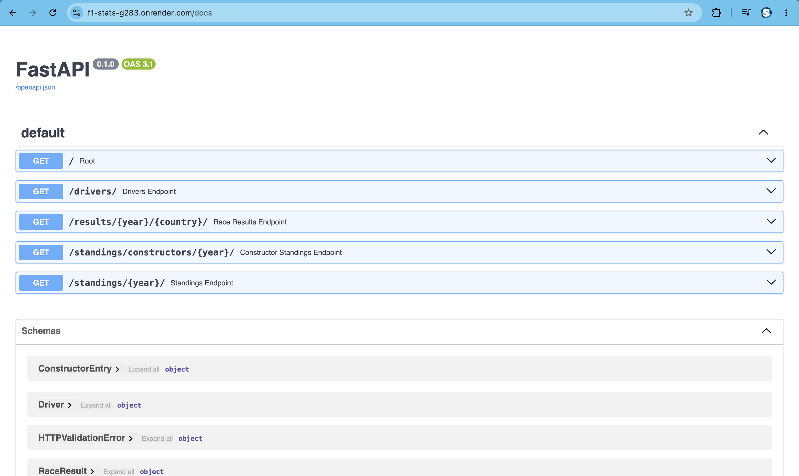

# F1-Stats

Backend REST API zwracający aktualne klasyfikacje, wyniki wyścigów i informacje o kierowcach Formuły 1. Asynchroniczne pobieranie danych z OpenF1 API, cache'owanie, walidacja Pydantic oraz 29 testów jednostkowych z mockowaniem async (pytest fixtures + monkeypatch + tmp_path).


## Live Demo

API dostępne pod: [https://f1-stats-g283.onrender.com](https://f1-stats-g283.onrender.com)

Interaktywna dokumentacja (Swagger UI): [https://f1-stats-g283.onrender.com/docs](https://f1-stats-g283.onrender.com/docs)

> Aplikacja jest hostowana na darmowym planie Render — pierwsze wywołanie po dłuższej bezczynności może trwać ~30-50 sekund (cold start).



## Roadmap

### Zrobione
- Asynchroniczne REST API integrujące się z OpenF1 API
- Równoległe zapytania (asyncio.gather) z limitowaniem
- Walidacja danych przez Pydantic
- Własny system cache
- Testy jednostkowe z mockowaniem
- Podział na warstwy (main / schemas / services)

### W trakcie
- Testy dla get_constructor_standings (pozostała funkcja serwisowa)
- Konteneryzacja aplikacji (Docker)

### Planowane
- PostgreSQL — trwałe składowanie i optymalizacja danych
- Redis — warstwa cache nad bazą danych
- Model użytkowników z rejestracją i logowaniem
- Autoryzacja JWT
- Prosty frontend konsumujący API

## Technologie

- Python 3.13
- FastAPI 0.136
- Pydantic 2.13
- httpx 0.28 (async)
- pytest 9.0, pytest-asyncio 1.3
- uvicorn 0.46
- OpenF1 API (zewnętrzne źródło danych)
- Render (deploy, Frankfurt EU)

## Funkcjonalności

- Asynchroniczne równoległe pobieranie ~25 sesji z OpenF1
- Cache file-based (pierwszy request ładuje sezon, kolejne natychmiastowe)
- Rate limiting (Semaphore + sleep)
- Obsługa błędów HTTP (404 / 502 / 503) z mockowaniem retry'ów
- Walidacja parametrów (Pydantic + Path z ge/le)
- 29 testów jednostkowych z pytest (fixtures w conftest.py, monkeypatch dla stałych, tmp_path dla I/O, side_effect dla wielokrotnych wywołań mocka)
- Clean architecture (separacja services/routers/schemas)

## Instalacja

```bash
git clone https://github.com/Maksymilian03/F1-Stats
cd F1-Stats
python -m venv venv
# Windows
venv\Scripts\activate
# Mac/Linux
source venv/bin/activate
pip install -r requirements.txt
uvicorn main:app --reload
```

Aplikacja będzie dostępna pod `http://localhost:8000`. Dokumentacja Swagger pod `http://localhost:8000/docs`.

## Endpointy API

| Metoda | Endpoint | Opis |
|--------|----------|------|
| GET | / | Root endpoint |
| GET | /drivers/ | Lista aktualnych kierowców F1 |
| GET | /results/{year}/{country}/ | Wyniki konkretnego wyścigu |
| GET | /standings/{year}/ | Klasyfikacja kierowców |
| GET | /standings/constructors/{year}/ | Klasyfikacja konstruktorów |

Parametr `year` przyjmuje wartości 2023-2025.

### Przykład odpowiedzi: GET /standings/2024/

```json
[
  {
    "position": 1,
    "full_name": "Max VERSTAPPEN",
    "team": "Red Bull Racing",
    "points": 434,
    "wins": 9,
    "driver_number": 1
  },
  {
    "position": 2,
    "full_name": "Lando NORRIS",
    "team": "McLaren",
    "points": 368,
    "wins": 4,
    "driver_number": 4
  }
]
```

## Architektura

Aplikacja jest podzielona na trzy warstwy:

- `main.py` — Routery FastAPI + walidacja parametrów (Path)
- `services.py` — Logika biznesowa, integracja z OpenF1, cache
- `schemas.py` — Modele Pydantic (response_model)
- `tests/` — 29 testów jednostkowych:
  - logika obliczeń: calculate_points, aggregate_points_by_team, leaderboard, merge_driver_details
  - integracja z OpenF1 (mock async): fetch_drivers, fetch_session_results, get_races_and_sprints
  - endpoint orchestracji: get_driver_standings (happy path + cache hit)
  - `conftest.py` — fixtures z danymi testowymi (6 fixtures)
- `cache/` — File-based cache (gitignored)

### Flow danych — przykład GET /standings/2024/

1. Endpoint w `main.py` waliduje parametr `year` (Path z `ge=2023, le=2025`)
2. Service `get_standings(2024)` sprawdza cache — jeśli istnieje i nie wygasł, zwraca natychmiast
3. Cache miss: funkcja pobiera listę sesji (~25: race + sprint) z OpenF1
4. Równolegle (`asyncio.gather`) pobiera wyniki każdej sesji — z rate limitingiem (`Semaphore(2)` + sleep)
5. Agregacja punktów per kierowca (czyste funkcje, łatwe do testowania)
6. Merge z danymi kierowców (full_name, team_name)
7. Sortowanie + dodanie pozycji (`leaderboard()` z tie-breakerem po wins)
8. Cache save + Pydantic validation (`response_model=List[StandingsEntry]`)
9. Zwrot do klienta w postaci JSON

## Uruchamianie testów

```bash
pytest tests/ -v
```
